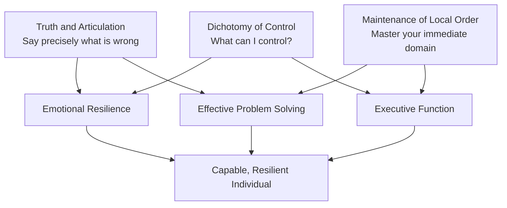

# Philosophical Framework

This document defines the timeless philosophical principles that underpin Ava's developmental plan. These principles do not change by age — only their application methods evolve across stages.

## Core Principle 1: The Dichotomy of Control

**Source:** Epictetus, *Enchiridion* (translated by W.A. Oldfather, Loeb Classical Library, 1925)

> "Some things are within our power, while others are not."

### Definition
The rigid distinction between external variables (which cannot be manipulated) and internal judgments and reactions (which are subject to personal control). This is the foundational cognitive tool for emotional resilience.

### Relationship to Modern Psychology
The Dichotomy of Control functions as a precursor to Cognitive Behavioral Therapy (CBT). The APA recognizes CBT as a highly authoritative, evidence-based intervention for pediatric anxiety and emotional dysregulation. The core mechanism is identical: events do not cause emotional distress — interpretations of events do.

### Application Across Development

- **Infancy (0-12mo):** Parental modeling. Parents verbalize the distinction when navigating frustrations in the child's presence. The infant absorbs tone, emotional cadence, and resolution patterns.
- **Toddlerhood (12-36mo):** Redirection. When frustration arises from uncontrollable circumstances (a toy breaks, weather cancels an outing), redirect attention to what *can* be chosen next. Language: "That happened. What do we do now?"
- **Early Childhood (3-5yr):** Explicit teaching. Name the concept. Use simple framing: "Can you change this? No? Then what *can* you change?" Practice with low-stakes scenarios.
- **School Age (5-7yr):** Analytical application. Apply the dichotomy to stories, historical figures, and the child's own social experiences. Require articulation of what was and wasn't controllable in a given situation.

### Conflict Resolution with Modern Developmental Psychology
Traditional classical Stoicism advocates for suppression or complete detachment from emotional states (*apatheia*). Modern developmental psychology (AAP, APA) emphasizes the necessary experiencing and processing of emotions.

**Resolution:** The Dichotomy of Control is applied strictly as a mechanism for cognitive behavioral regulation — *how one responds to the emotion and the external event* — rather than a mandate for emotional suppression. The emotion is acknowledged and felt. The response is then chosen deliberately. See [SOURCE-EVALUATION.md](SOURCE-EVALUATION.md) for full conflict analysis.

---

## Core Principle 2: The Principle of Truth and Articulation

**Source:** Jordan B. Peterson — frameworks regarding the articulation of truth and the maintenance of local order.

### Definition
Demanding progressive precision in speech as vocabulary expands. The requirement to accurately verbalize a problem prior to receiving intervention. This practice aligns cognitive processing with language articulation.

### Scientific Basis
Research published by NICHD demonstrates that children with delayed expressive language skills exhibit higher frequencies of tantrums and physical aggression due to the inability to effectively communicate needs and frustrations. The pedagogical strategy involves requiring accurate verbalization of a problem *before* intervention.

### Application Across Development

- **Infancy (0-12mo):** Not directly applicable. Focus on language exposure and responsiveness to vocalizations.
- **Toddlerhood (12-36mo):** As first words emerge, gently require pointing, gesturing, or attempting words before fulfilling requests. Do not anticipate every need — create space for communication attempts.
- **Early Childhood (3-5yr):** Require sentences. "Use your words" becomes "Tell me exactly what happened." Model precise language. When the child says "it's bad," ask "What specifically is bad? How does it feel?"
- **School Age (5-7yr):** Require progressively articulate descriptions of problems, feelings, and desires. Engage in dialectic: ask follow-up questions, require defense of statements, reward precision.

### Guardrail
This principle must never become punitive. A child struggling to articulate is helped, not withheld from. The goal is to build the habit and capacity for precise expression, not to create anxiety around communication. Patience calibrates to developmental readiness.

---

## Core Principle 3: The Maintenance of Local Order

**Source:** Peterson, J.B.; supported by the Center on the Developing Child at Harvard University.

### Definition
Establishing a rigid expectation for the organization of the immediate physical environment as a physical manifestation of psychological order. Mastery of local, manageable domains acts as the cognitive prerequisite for navigating broader societal complexities.

### Scientific Basis
The Center on the Developing Child at Harvard University identifies organized, predictable environments as critical for the development of executive function skills, including working memory, mental flexibility, and self-control.

### Application Across Development

- **Infancy (0-12mo):** Parental responsibility. Maintain an organized, predictable environment. Consistent placement of objects. Predictable routines for sleep, feeding, play.
- **Toddlerhood (12-36mo):** Introduction of "clean up" as a routine. Designated places for toys. The child participates in restoring order with assistance. Make it concrete and achievable.
- **Early Childhood (3-5yr):** The child owns their space. Bedroom and play area organization becomes their responsibility with guidance. "Before we start something new, we finish what's out."
- **School Age (5-7yr):** Expanded domains of responsibility. The principle extends to schoolwork organization, personal belongings, and time management basics. The connection between local order and reduced chaos is made explicit.

---

## Synthesis: How the Three Principles Interact

The three principles are mutually reinforcing:
1. **Control** determines where to direct energy
2. **Articulation** transforms internal chaos into communicable, solvable problems
3. **Order** builds the executive function required to act on both

A child who can identify what is within their control, articulate what they need, and maintain order in their immediate environment has the cognitive and emotional foundation for navigating complexity at any scale.
