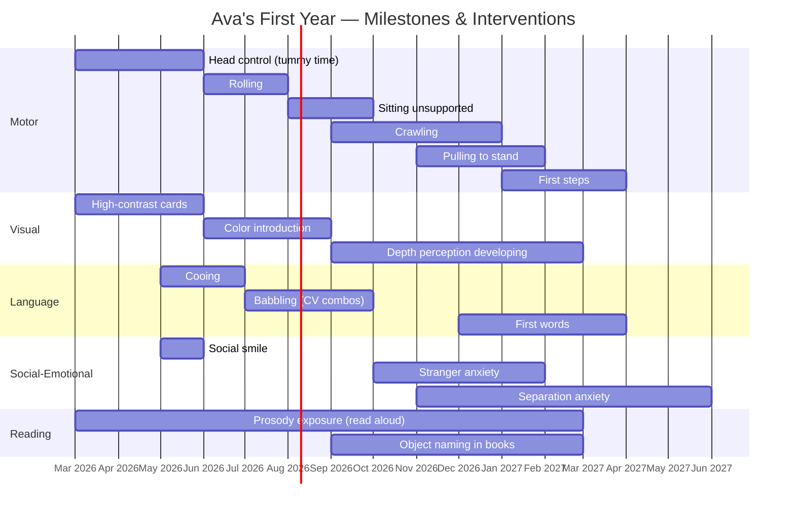
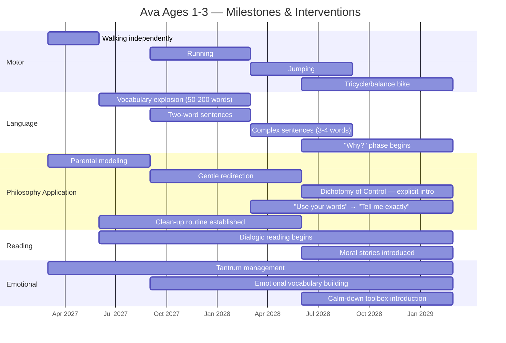
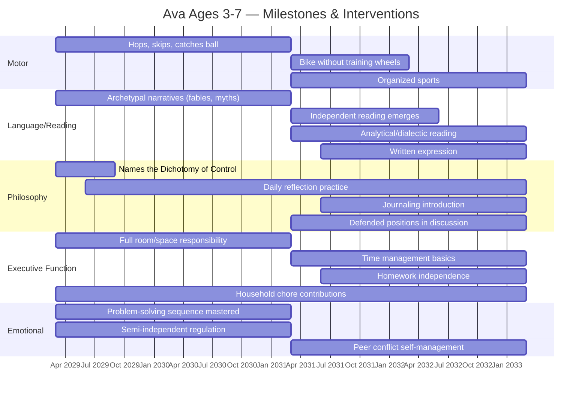

# Developmental Timeline

Master timeline mapping milestones to interventions across all domains.

---

## Birth to 12 Months

## Year 1 to Year 3

## Year 3 to Year 7

---

## Critical Intervention Windows

These are periods where specific interventions have the highest impact based on neurodevelopmental research:

| Window | Age | Intervention | Basis |
|--------|-----|-------------|-------|
| **Visual system formation** | 0-4 months | High-contrast stimulation | AOA — optic nerve myelination |
| **Attachment formation** | 0-18 months | Responsive caregiving, serve-and-return | Bowlby/Ainsworth — secure base |
| **Language acquisition peak** | 6-36 months | Language-rich environment, dialogic reading | NICHD — neural pruning of phoneme sensitivity |
| **Executive function foundation** | 2-5 years | Structured environment, routine, clean-up | Harvard Center — EF skill scaffolding |
| **Moral reasoning foundation** | 3-7 years | Archetypal stories, philosophical framework | Vygotsky — ZPD for moral concepts |
| **Reading fluency** | 5-7 years | Daily independent reading + analytical discussion | National Reading Panel |
