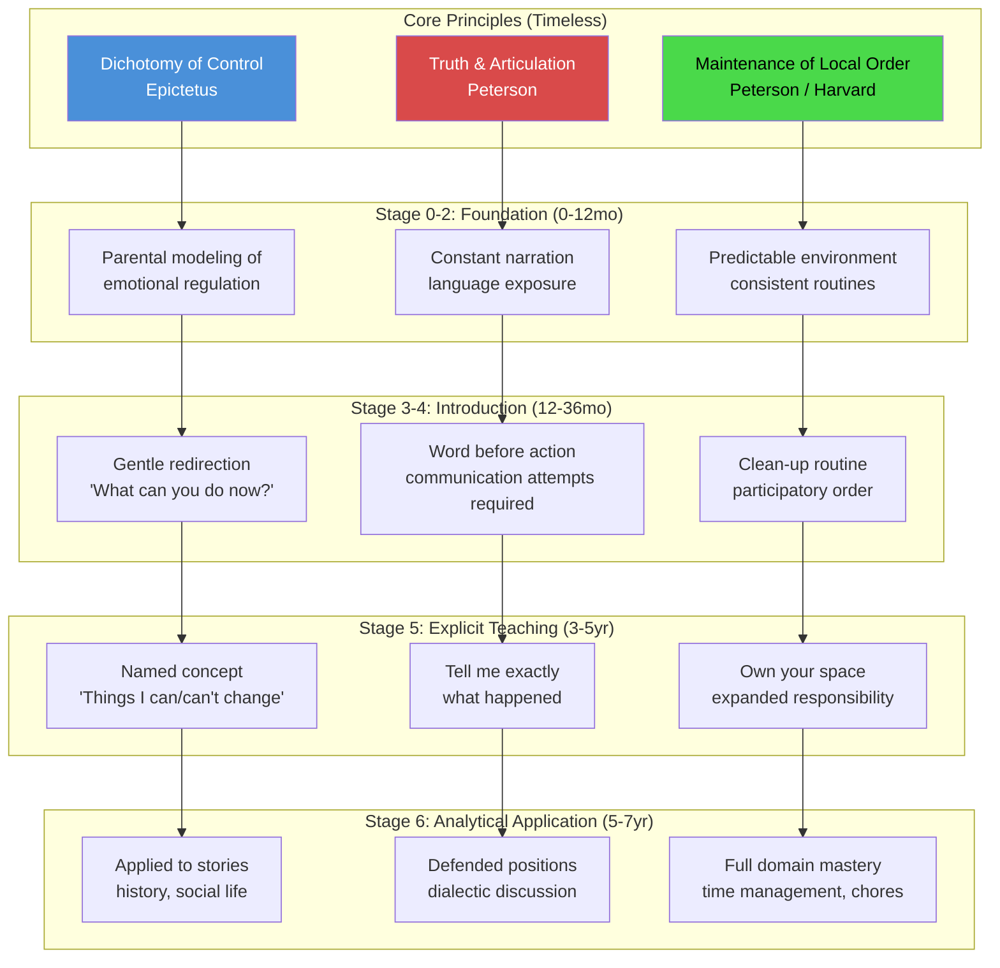
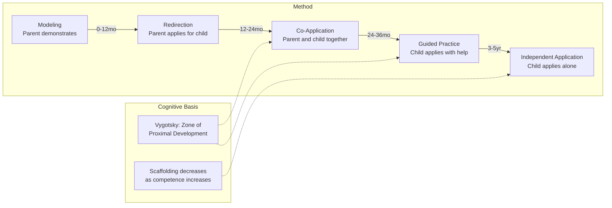
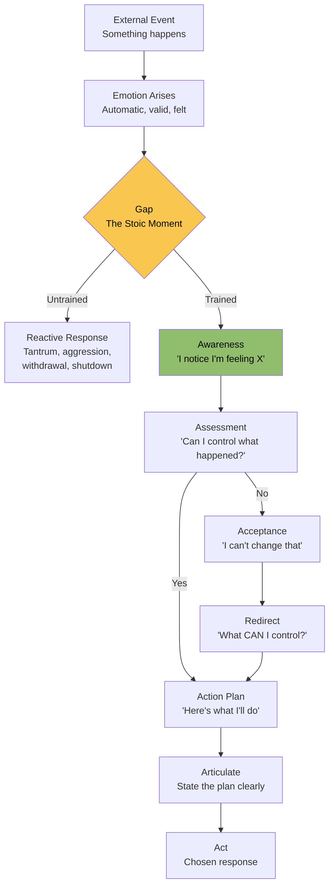
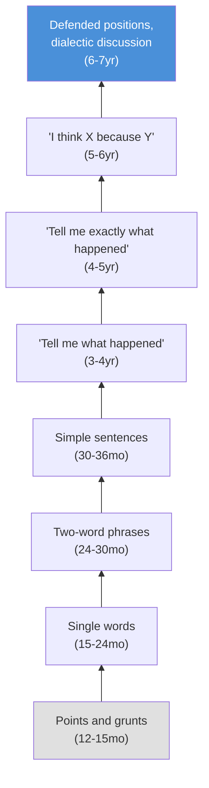
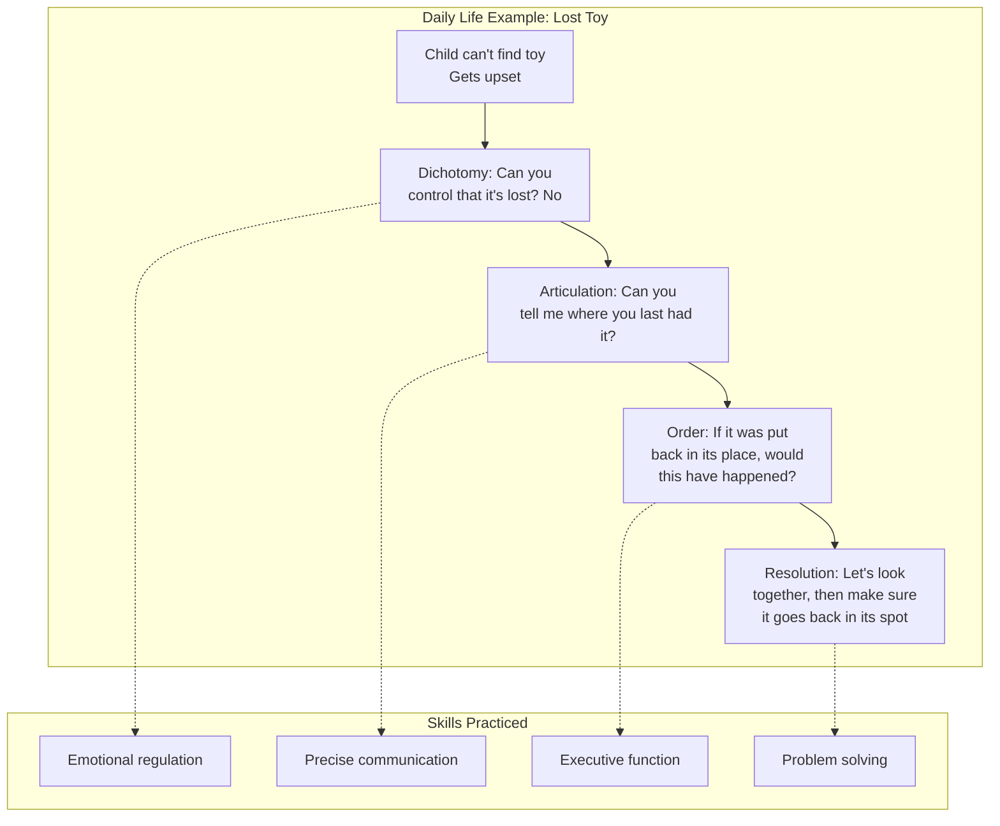

# Philosophical Framework Diagram

How Stoic and CBT concepts layer onto developmental stages.

---

## Framework Application Across Stages

## Teaching Method Evolution

## Emotional Regulation Pathway

## The Articulation Ladder

## Integration: How the Three Principles Reinforce Each Other

