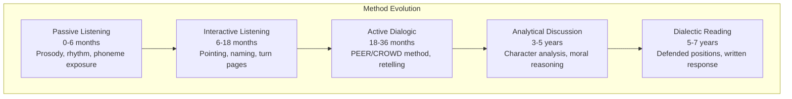
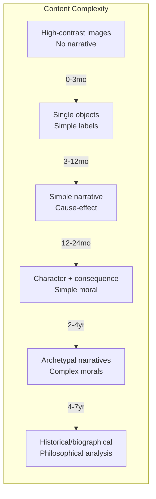
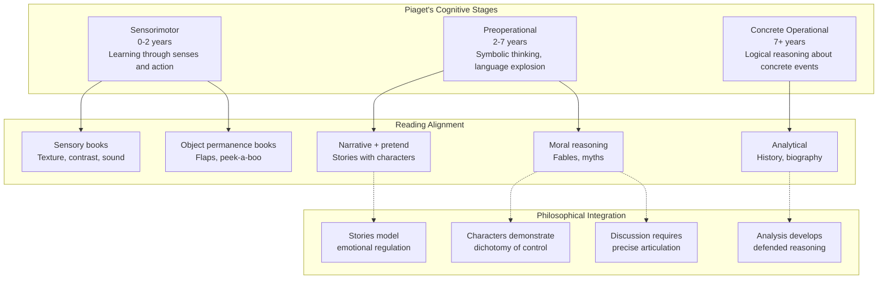
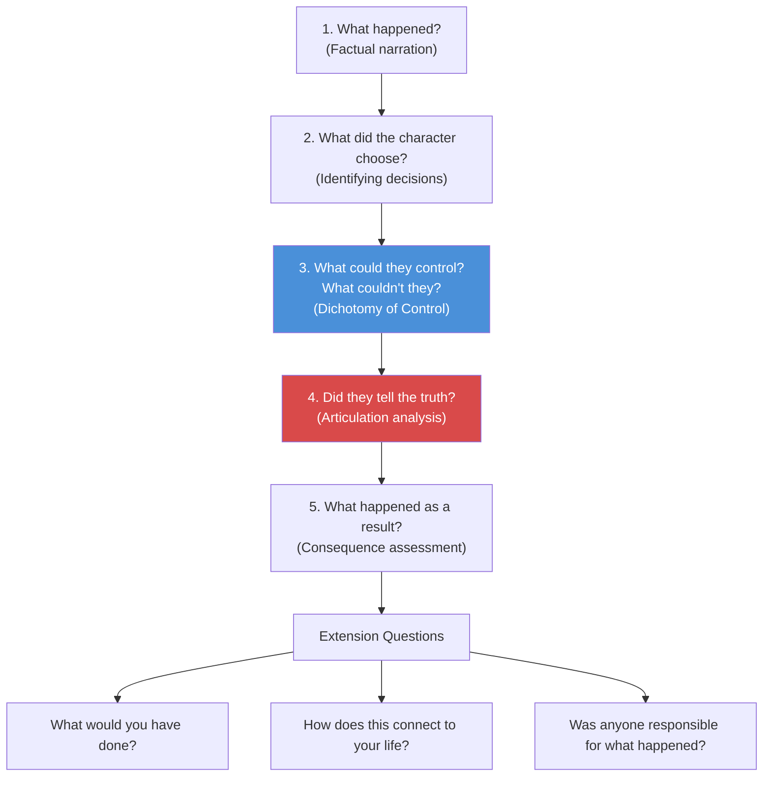
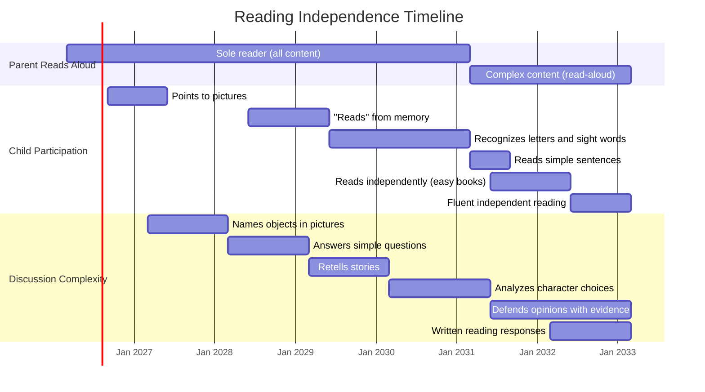

# Reading Progression Diagram

Book complexity and reading method mapped to cognitive development stages.

---

## Reading Method Progression

## Book Complexity Progression

## Cognitive Basis for Reading Stages

## The Five Questions — Reading Discussion Framework

Applied from Stage 4 (18-36 months) onward, with increasing sophistication:

## Independent Reading Progression

