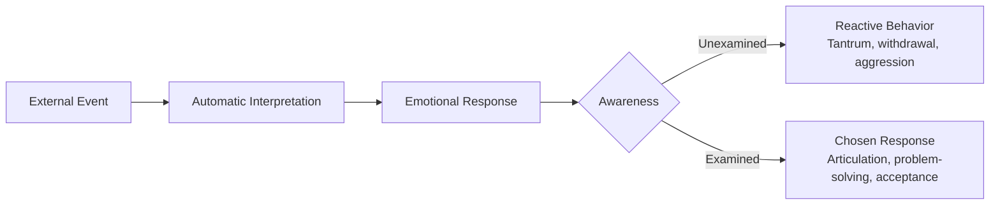

# Emotional Regulation Framework

Integration of Stoic philosophy, Cognitive Behavioral Therapy principles, and modern developmental psychology for building emotional resilience across all stages.

---

## Theoretical Foundation

### The Bridge: Stoicism to CBT

The Dichotomy of Control (Epictetus) and Cognitive Behavioral Therapy (APA) share a core mechanism:

> Events do not cause emotional distress. **Interpretations of events** cause emotional distress.

**Critical distinction from classical Stoicism:** We do NOT teach emotional suppression (*apatheia*). The emotion is real, valid, and neurologically necessary. What we teach is the **gap between stimulus and response** — the moment of choice.

See [SOURCE-EVALUATION.md](../SOURCE-EVALUATION.md) for full conflict resolution on Stoic apatheia vs. modern emotional processing.

---

## Emotional Vocabulary Development

Building a precise emotional vocabulary is prerequisite to regulation. You cannot manage what you cannot name.

### Vocabulary by Stage

**12-24 months (introduce through parental narration):**
happy, sad, angry, scared, tired, hungry

**24-36 months (child begins using):**
frustrated, excited, surprised, nervous, proud, silly, confused, lonely

**3-5 years (precision expansion):**
disappointed, embarrassed, jealous, worried, grateful, curious, overwhelmed, calm, brave, anxious, left out

**5-7 years (nuanced distinctions):**
humiliated vs. embarrassed, anxious vs. scared, disappointed vs. sad, irritated vs. angry, envious vs. jealous, content vs. happy, determined vs. stubborn

### Teaching Method
- **Name emotions in real time** — both the child's and your own: "I'm feeling frustrated because traffic is slow."
- **Name emotions in stories** — "How do you think the rabbit felt? Why?"
- **Never correct an emotion** — "You shouldn't feel that way" is never appropriate. Emotions are data. Responses are choices.
- **Distinguish emotion from behavior** — "It's okay to be angry. It's not okay to hit."

---

## The Regulation Protocol (Age-Adapted)

### Core Sequence (for caregivers and eventually the child)

1. **Notice** — "I see something is happening"
2. **Name** — "You're feeling [emotion]"
3. **Validate** — "That makes sense because [reason]"
4. **Breathe** — Physiological regulation (deep breaths, counting)
5. **Assess** — "Can you change what happened?"
6. **Choose** — "What can you do now?"

### By Stage

**0-12 months: Co-Regulation**
The infant cannot self-regulate. The caregiver IS the regulation system.
- Respond promptly to distress (builds secure attachment — Bowlby/Ainsworth)
- Maintain calm presence. Your nervous system regulates theirs
- Narrate: "You're upset. I'm here. We're going to figure this out."
- Physical comfort: holding, rocking, skin-to-skin

**12-24 months: Assisted Regulation**
The toddler begins to experience named emotions but cannot manage them.
- Stay present during tantrums. Do not isolate or punish
- Name the emotion: "You're really frustrated right now"
- Wait for the emotional peak to pass — do NOT reason during peak arousal
- After de-escalation: "You were upset because [X]. That's okay. Now what should we do?"
- Offer two choices to restore agency

**24-36 months: Guided Regulation**
The child can begin participating in the regulation process.
- Teach "belly breaths" — breathe in through nose (smell the flowers), out through mouth (blow out the candles)
- Introduce a "calm down" space — NOT a punishment corner. A cozy spot with soft objects where the child CHOOSES to go when overwhelmed
- After calm: walk through the sequence. "What happened? How did you feel? Could you change it? What did you do? What could you try next time?"

**3-5 years: Semi-Independent Regulation**
The child can identify emotions and begin choosing responses with guidance.
- The child names their own emotion: "I'm angry because..."
- Introduce the two-column concept: "Things I can change / Things I can't change"
- Practice with stories and hypotheticals before applying to real situations
- Role-play difficult scenarios: "What if someone takes your toy? Let's practice."
- Begin teaching: "When you feel [emotion], you can [strategy]" — create a personal toolbox

**5-7 years: Developing Independence**
The child manages most emotional challenges with decreasing adult support.
- Journaling or verbal daily reflection: "What was hard today? How did I handle it?"
- The child articulates the full sequence independently: event → emotion → control assessment → chosen response
- Peer conflict resolution with decreasing adult mediation
- Introduce the concept that others also have internal experiences (Theory of Mind deepening)
- Frame mistakes and failures as information: "What does this tell us? What do we do differently?"

---

## Common Challenges and Responses

### Tantrums (12-36 months)

**Do:**
- Stay calm and present
- Ensure physical safety
- Acknowledge the emotion
- Wait for de-escalation
- Process after calm returns

**Do NOT:**
- Punish the emotion
- Reason during peak arousal
- Give in to end the tantrum (teaches escalation)
- Shame ("Big girls don't cry")
- Isolate ("Go to your room")

### Anxiety (3-7 years)

**Do:**
- Acknowledge the fear as real
- Distinguish between danger (real threat) and worry (imagined threat)
- Apply the dichotomy: "What specifically are you worried about? Can you control it?"
- Create a concrete plan for what IS controllable
- Gradual exposure to feared situations with support

**Do NOT:**
- Dismiss ("There's nothing to be scared of")
- Accommodate avoidance long-term (avoiding the thing makes anxiety worse)
- Transfer your own anxiety
- Over-reassure (constant reassurance becomes its own compulsion)

### Aggression (12 months – 7 years)

**Do:**
- Set the boundary immediately: "I won't let you hit"
- Remove from the situation if needed
- Name the underlying emotion: "You're angry. Hitting is not okay. What are you angry about?"
- Teach alternatives: stomping feet, squeezing a pillow, using words
- Address the root cause after the behavior is stopped

**Do NOT:**
- Hit back or use physical punishment (models the behavior you're trying to eliminate)
- Ignore it
- Only punish without teaching the alternative

### Lying (3-7 years)

**Context:** Lying is a cognitive milestone (Theory of Mind development) — the child understands that others have different beliefs than they do.

**Response:**
- Do not panic or overreact
- Apply the articulation principle: "I need you to tell me exactly what happened. The truth."
- Explain why truth matters: "I need to know what really happened so I can help."
- Focus on the behavior, not the character: "You told a lie" not "You are a liar"
- Model truth-telling, including admitting your own mistakes

---

## The Calm-Down Toolbox

A collection of strategies the child learns and can choose from. Build this progressively:

| Strategy | Age Introduced | Description |
|----------|---------------|-------------|
| **Belly breaths** | 2 years | Deep breathing with visual metaphor (flowers/candles) |
| **Counting** | 2.5 years | Count to 10 slowly before responding |
| **Calm space** | 2.5 years | A designated cozy spot (NOT punishment) |
| **Squeeze something** | 3 years | Stress ball, stuffed animal, pillow |
| **Name it to tame it** | 3 years | Say the emotion out loud |
| **Walk away** | 3.5 years | Physically leave a frustrating situation temporarily |
| **Draw it** | 4 years | Draw the feeling or the situation |
| **Talk to someone** | 4 years | Articulate the problem to a trusted person |
| **Journal it** | 5-6 years | Write or draw about what happened and how it felt |
| **Reframe it** | 6 years | "What's another way to think about this?" |

---

## Secure Attachment as Foundation

All regulation work depends on secure attachment (Bowlby, Ainsworth).

**The non-negotiables:**
- Respond to distress promptly and consistently (infancy)
- Be emotionally available and attuned
- Repair ruptures quickly — when you lose your temper or respond poorly, acknowledge it: "I'm sorry I yelled. I was frustrated. That wasn't the right way to handle it. Let me try again."
- The child must trust that the caregiver is a safe base. Without this, no emotional regulation framework will be effective
- **Modeling is the primary teaching mechanism.** The child will do what you do, not what you say. Regulate yourself first.
