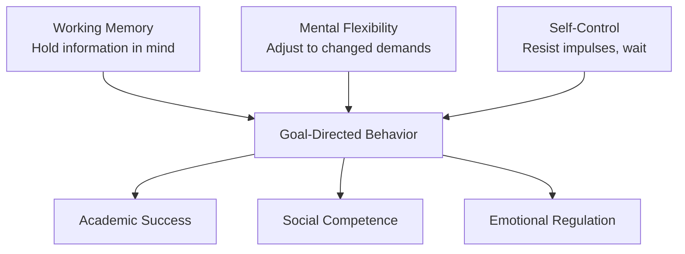

# Environment and Order

Physical space design, routine structure, and the development of executive function through the Maintenance of Local Order.

---

## Theoretical Basis

**Source:** Center on the Developing Child, Harvard University — organized, predictable environments are critical for executive function development (working memory, mental flexibility, self-control).

**Principle:** The physical environment is a manifestation of psychological order. Mastery of local, manageable domains acts as the cognitive prerequisite for navigating broader complexities.

See [PHILOSOPHY.md](../PHILOSOPHY.md), Core Principle 3.

---

## Executive Function Development

Executive function (EF) is the set of cognitive skills that enable goal-directed behavior. These skills develop rapidly from birth to age 7 and are strongly influenced by environmental structure.

### The Three Core EF Skills

### How Environment Supports EF

| Environmental Feature | EF Skill Supported | Mechanism |
|----------------------|-------------------|-----------|
| Consistent routines | Working memory | Child predicts and remembers sequences |
| Labeled storage locations | Working memory | Reduces cognitive load of remembering where things are |
| Transition warnings | Mental flexibility | Prepares for change, reduces rigidity |
| Choices within structure | Self-control | Practices decision-making within boundaries |
| Clean-up routines | All three | Requires remembering (what goes where), flexibility (stopping play), and impulse control (doing it when you'd rather not) |

---

## Space Design by Stage

### Infant Space (0-12 Months)

**Principles:** Safe, stimulating, predictable, accessible

**Setup:**
- **Play area:** Firm mat on floor, clear of clutter. Rotate 3-5 toys weekly (novelty without overwhelm)
- **Sleep space:** Separate, consistent location. Dark, cool, quiet. AAP safe sleep guidelines
- **Feeding area:** Consistent location for feeding. Calm environment
- **Tummy time station:** Mirror, high-contrast cards, 2-3 motivating toys

**Key features:**
- Minimal visual clutter on walls (infant visual system is easily overwhelmed)
- Natural light where possible during awake periods
- Consistent sound environment (quiet for sleep, gentle music for play)
- Everything the infant needs is in a predictable location

### Toddler Space (12-36 Months)

**Principles:** Independence-enabling, bounded, organized, child-height

**Setup:**
- **Low open shelving:** Toys visible and accessible. Each toy/set has a designated spot. Use picture labels
- **Child-height hooks:** For coats, bags, dress-up clothes
- **Step stools:** Bathroom, kitchen (where safe), light switches
- **Art station:** Child-sized table and chair, crayons/markers in containers, paper accessible
- **Book nook:** Low shelf or basket, comfortable spot to sit (cushion, small chair)
- **Calm-down space:** A cozy corner with soft items. NOT a punishment area. The child chooses to go here

**Key features:**
- Everything the child uses regularly is within their reach
- Storage is visible and labeled (pictures at this stage)
- Fewer toys out = more focused play. Rotate regularly
- Designated eating area (not the play area)

### Early Childhood Space (3-5 Years)

**Principles:** Responsibility, categorization, work vs. play distinction

**Setup:**
- **Play area:** Organized by category (building toys, art supplies, dress-up, books). Child maintains organization
- **Work space:** Distinct from play area. Table/desk for focused activities (drawing, puzzles, pre-writing). Minimal distractions
- **Reading nook:** Comfortable, well-lit, stocked with current books. A "special" place
- **Personal responsibility zone:** The child's room or area they are responsible for maintaining
- **Household contribution areas:** Accessible cleaning supplies (child-safe), designated chore zones

**Key features:**
- Labels transition from pictures to pictures + words
- Visual routine charts on walls (morning, bedtime, after school)
- Calendar visible — mark special days, build time awareness
- The child participates in organizing and maintaining their space

### School-Age Space (5-7 Years)

**Principles:** Independence, time management, academic support, full ownership

**Setup:**
- **Study space:** Quiet desk/table, good lighting, organized supplies. No screens. Consistent homework location
- **Personal planner area:** Wall calendar or planner visible. Weekly schedule the child helps create
- **Storage system:** The child designs (with guidance) their own organizational system for belongings
- **Creative space:** Art supplies, building materials, instrument practice area
- **Responsibility hub:** Chore chart, backpack/lunch prep station, clothing laid out area

**Key features:**
- Labels are word-only (reading fluency assumed)
- Time management tools: clock, timers, visual schedules
- The child manages their morning and evening routines independently
- Natural consequences for disorganization (can't find homework = dealing with it at school)

---

## Routine Structure

### Why Routines Matter
Predictable routines reduce anxiety, build executive function, and free cognitive resources for learning and exploration. The child doesn't have to wonder "what happens next?" — they know, and can focus on the present activity.

### Routine Architecture (All Ages)

**Morning routine:**
1. Wake
2. Hygiene (diaper/toilet, face wash, teeth)
3. Dress
4. Breakfast
5. Activity/school prep

**After-activity routine:**
1. Transition warning ("5 minutes")
2. Clean up current activity
3. Next activity begins

**Bedtime routine:**
1. Transition warning
2. Clean up / tidy space
3. Bath/hygiene
4. Pajamas
5. Reading (2-3 books infant, 1 chapter older)
6. Reflection/conversation (when verbal)
7. Lights out

### Routine Visual Aids

**12-24 months:** Parental narration of routine steps. Consistency IS the visual aid
**24-36 months:** Picture chart (photos or simple drawings of each step)
**3-5 years:** Picture + word chart. Child moves a marker/magnet along the steps
**5-7 years:** Written checklist. Child checks off independently

---

## Transition Management

Transitions (changing activities, leaving places, stopping play) are a major source of conflict, especially ages 18 months to 5 years.

### Protocol
1. **Advance warning:** "In 10 minutes, we're going to clean up." (Use visual timer if possible)
2. **Reminder:** "5 more minutes."
3. **Final warning:** "2 more minutes. What do you want to finish?"
4. **Transition:** "Time's up. Let's clean up. What goes first?"
5. **Bridge to next activity:** "After we clean up, we get to [next thing]."

### Why this works:
- Predictability reduces anxiety
- Countdown gives the child agency over their final moments of current activity
- Bridging to the next activity provides motivation
- Consistent application builds the neural pathway — the child learns that warnings are real and transitions are manageable

---

## The Clean-Up Protocol

### By Stage

**12-18 months:** Parent does 90%, child participates symbolically (hands one toy to parent, drops one item in bin). Celebrate wildly.

**18-24 months:** Parent does 70%, child does 30%. Sing a clean-up song. Make it routine, not punishment. Offer choices: "Do you want to put away the blocks or the cars first?"

**24-36 months:** 50/50 split. The child knows where things go. "Before we start something new, we put away what's out."

**3-5 years:** Child does 80% with reminders. "Is your space ready for the next thing?" Parent helps when the task is genuinely overwhelming (too many items at once — help them start, then step back).

**5-7 years:** Child cleans independently. Natural consequences for not cleaning (can't start the next thing until the space is ready, can't find items in messy space).

### Key Principle
Clean-up is NEVER a punishment. It is a natural part of the activity cycle: get out → use → put away. It is presented as competence and responsibility, not deprivation.
