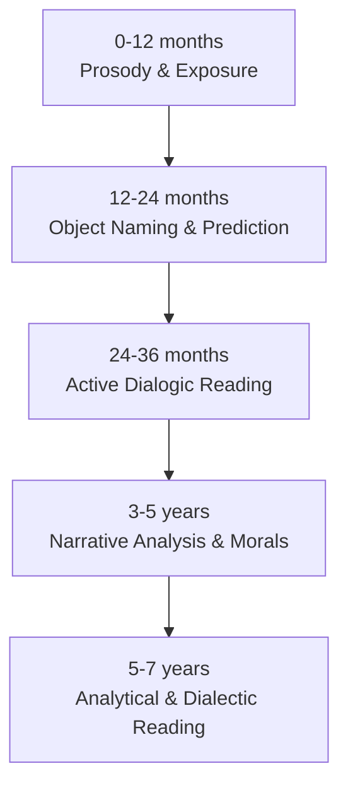

# Reading Curriculum

Book recommendations organized by developmental stage, reading method progression, and philosophical alignment.

---

## Reading Method Progression

See [language-communication.md](language-communication.md) for the full dialogic reading method (PEER/CROWD).

---

## Stage 0: Neonatal (0-3 Months)

**Goal:** Neurological language acquisition, prosody exposure, visual stimulation

**Reading style:** Slow, exaggerated prosody. Clear enunciation. Pause at page turns.

| Book | Author | Why |
|------|--------|-----|
| *Black White* | Tana Hoban | High-contrast photography, visual development |
| *Look Look!* | Peter Linenthal | Bold black/white patterns with one color accent |
| *Hello, World!* (high contrast) | Various | Simple shapes, high contrast |
| *Goodnight Moon* | Margaret Wise Brown | Rhythmic, repetitive, calming prosody |
| *Guess How Much I Love You* | Sam McBratney | Gentle cadence, warm tone |

**Note:** At this stage, the infant benefits from hearing *any* book read aloud. The specific content is secondary to the exposure to varied phonemes, rhythm, and the social bonding of being held while being read to.

---

## Stage 1: Early Infancy (3-6 Months)

**Goal:** Object tracking, cause-effect introduction, interactive engagement

**Reading style:** Point to images. Name objects clearly. Pause for infant to fixate.

| Book | Author | Why |
|------|--------|-----|
| *Dear Zoo* | Rod Campbell | Flap book — cause and effect, anticipation |
| *Brown Bear, Brown Bear* | Bill Martin Jr. / Eric Carle | Pattern, repetition, color naming |
| *Pat the Bunny* | Dorothy Kunhardt | Tactile engagement, multi-sensory |
| *Peek-a-Baby* | Karen Katz | Object permanence introduction |
| *Baby Faces* | DK Publishing | Face preference, emotional expression |

---

## Stage 2: Late Infancy (6-12 Months)

**Goal:** Object permanence reinforcement, vocabulary foundation, cause-effect in narrative

**Reading style:** Point and name every object. Lift-the-flap interactions. Pause for pointing/babbling responses.

| Book | Author | Why |
|------|--------|-----|
| *Where's Spot?* | Eric Hill | Search narrative, flap book, prediction |
| *First 100 Words* | Roger Priddy | Vocabulary building, pointing practice |
| *The Very Hungry Caterpillar* | Eric Carle | Sequence, counting, cause-effect, transformation |
| *Moo, Baa, La La La!* | Sandra Boynton | Sound association, humor, rhythm |
| *Goodnight Gorilla* | Peggy Rathbone | Visual storytelling, minimal text, humor |
| *Toes, Ears, & Nose* | Marion Dane Bauer | Body parts, lift-the-flap |

---

## Stage 3: Early Toddler (12-18 Months)

**Goal:** Vocabulary explosion support, simple narrative comprehension, imitation

**Reading style:** "What's that?" pointing games. Accept all vocal responses. Expand utterances.

| Book | Author | Why |
|------|--------|-----|
| *First 100 Animals* | Roger Priddy | Vocabulary expansion, categorization |
| *From Head to Toe* | Eric Carle | Body awareness, imitation, action words |
| *Llama Llama Red Pajama* | Anna Dewdney | Separation anxiety, emotional naming |
| *Go, Dog. Go!* | P.D. Eastman | Prepositions, action, humor |
| *Press Here* | Herve Tullet | Cause-effect, interactive, agency |
| *I Am a Bunny* | Ole Risom / Richard Scarry | Seasons, nature, observation |

---

## Stage 4: Late Toddler (18-36 Months)

**Goal:** Narrative comprehension, moral introduction through story, emotional vocabulary in context

**Reading style:** Full dialogic reading. "Why?" questions. Character emotion identification. Retelling practice.

| Book | Author | Why | Philosophical Connection |
|------|--------|-----|------------------------|
| *The Gruffalo* | Julia Donaldson | Courage, cleverness, consequence | Articulation as power |
| *No, David!* | David Shannon | Boundaries, rules, unconditional love | Local order, consequences |
| *Corduroy* | Don Freeman | Perseverance, acceptance, friendship | What you can control |
| *Owl Babies* | Martin Waddell | Separation, trust, patience | Dichotomy of control |
| *The Little Engine That Could* | Watty Piper | Perseverance, self-talk, effort | Internal control |
| *Where the Wild Things Are* | Maurice Sendak | Emotional exploration, return to safety | Experiencing then regulating emotion |
| *Aesop's Fables* (pop-up/simplified) | Various | First moral framework in story form | Consequence of choices |
| *Knuffle Bunny* | Mo Willems | Frustration, communication, family | Articulation of needs |

---

## Stage 5: Early Childhood (3-5 Years)

**Goal:** Archetypal narratives, complex moral analysis, extended narrative engagement

**Reading style:** Pre-reading predictions. Post-reading analysis: what happened, why, what could they control, was it the right choice? Begin chapter books read-aloud.

| Book | Author | Why | Philosophical Connection |
|------|--------|-----|------------------------|
| *Aesop's Fables* (illustrated collection) | Various | Tortoise/Hare, Boy Who Cried Wolf, Ant/Grasshopper | Consequence, truth, preparation |
| *D'Aulaires' Book of Greek Myths* (selections) | Ingri & Edgar d'Aulaire | Consequence, hubris, courage | Limits of control, fate vs. choice |
| *The Lion, the Witch and the Wardrobe* | C.S. Lewis | Courage, sacrifice, temptation, betrayal | Moral choice under pressure |
| *Charlotte's Web* | E.B. White | Friendship, mortality, legacy, selflessness | What endures beyond control |
| *Frog and Toad* series | Arnold Lobel | Friendship, responsibility, gentle humor | Everyday virtue and order |
| *Anansi the Spider* | Gerald McDermott | Cleverness, consequence, cultural wisdom | Articulation as tool |
| *The Paper Bag Princess* | Robert Munsch | Independence, courage, critical thinking | Judging by action not appearance |
| *Strega Nona* | Tomie dePaola | Responsibility, following rules, consequence | Local order, listening |
| *Brave Irene* | William Steig | Perseverance through hardship | What is within your control |

---

## Stage 6: School Age (5-7 Years)

**Goal:** Historical and biographical narratives, adapted philosophical content, analytical and dialectic reading

**Reading style:** Full analytical discussion. Require defended opinions. Compare characters across books. Written responses begin. Independent reading alongside read-aloud of more complex material.

| Book | Author | Why | Philosophical Connection |
|------|--------|-----|------------------------|
| *D'Aulaires' Book of Greek Myths* (full) | Ingri & Edgar d'Aulaire | Full mythological framework | Hubris, fate, choice, consequence |
| *Norse Myths* (adapted) | Kevin Crossley-Holland | Resilience, sacrifice, facing the inevitable | Stoic acceptance, courage |
| *Little House on the Prairie* series | Laura Ingalls Wilder | Self-reliance, family, hardship, history | Mastery of local domain |
| *My Side of the Mountain* | Jean Craighead George | Independence, resourcefulness, nature | Control through competence |
| *The Chronicles of Narnia* (full series) | C.S. Lewis | Moral complexity, growth, temptation | Full philosophical framework applied |
| *The Hobbit* | J.R.R. Tolkien | Courage, greed, growth, unexpected hero | Choosing to act despite fear |
| *Who Was...?* biography series | Various | Real people, real choices, real consequences | Historical dichotomy analysis |
| *Stone Fox* | John Reynolds Gardiner | Determination, love, sacrifice | Effort within control |
| *Mrs. Frisby and the Rats of NIMH* | Robert C. O'Brien | Intelligence, responsibility, community | Order and cooperation |
| *Hatchet* | Gary Paulsen | Survival, self-reliance, resilience | Ultimate dichotomy of control |

---

## Reading Discussion Framework

For all books from Stage 4 onward, use this framework during or after reading:

### The Five Questions

1. **What happened?** — Factual narration of events
2. **What did the character choose to do?** — Identifying the decision point
3. **What could they control? What couldn't they?** — Dichotomy of Control application
4. **Did they tell the truth about the situation?** — Articulation analysis
5. **What happened as a result?** — Consequence assessment

### Extension Questions

- "What would you have done differently?"
- "Was there a moment when things could have gone differently?"
- "Who in this story was honest? Who wasn't? What happened because of that?"
- "What was the character responsible for?"
- "How does this connect to [something in your life]?"

---

## Annual Reading Goals (Approximate)

| Age | Daily Reading | Books per Year | Type |
|-----|--------------|----------------|------|
| 0-1 | 15-20 min (parent reads) | Unlimited re-reads of ~20-30 books | Board books |
| 1-2 | 20-30 min (parent reads) | ~50-75 (many re-reads) | Board + picture books |
| 2-3 | 20-30 min (parent reads) | ~75-100 | Picture books |
| 3-4 | 30 min (parent reads) | ~100-150 | Picture + early chapter |
| 4-5 | 30 min (parent reads) + 10 min (child "reads") | ~100-150 | Chapter books begin |
| 5-6 | 20 min (parent reads complex) + 15 min (child reads simple) | ~150-200 | Mixed independent + read-aloud |
| 6-7 | 15 min (parent reads complex) + 20 min (child reads independently) | ~200+ | Independent reading established |
